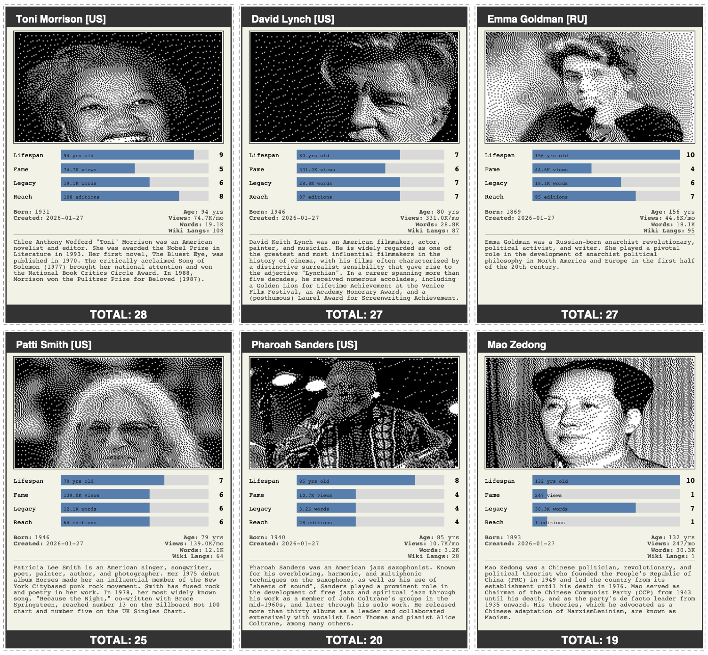

# Bio Battle

Ever wondered how Michael Jordan might fare in a completely ludicrous and impossible Top Trumps game against, say, Ada Lovelace, Carl Sagan, or Boudica? For some reason, I did, and thus, Bio Battle was born.



## What Actually Is It?

A trading card generator that creates cards with fairly nonsensical rankings extrapolated from Wikipedia articles.

Best not to take it too seriously, although Toni Morrison besting Chairman Mao with 28 points to 19 seems absolutely correct.

Now with **Thing Mode** - generate cards for trees, species, objects, and anything else Wikipedia knows about.

## What Does It Do?

Point it at a list of Wikipedia page titles and it will:

- Fetch data from Wikipedia for **people** or **things** (trees, species, objects, etc.)
- Download images and apply Floyd-Steinberg dithering
- Calculate scores across categories of dubious merit:
  - **People (4 categories)**: Lifespan, Fame, Legacy, Reach (max 40 points)
  - **Things (3 categories)**: Fame, Legacy, Reach (max 30 points)
- Render print-ready PDF cards (9 per A4 sheet)
- Sort cards from highest to lowest score, because someone has to be on top
- Cache everything always!

### Scoring Categories

| Category | Description | People | Things |
|----------|-------------|--------|--------|
| Lifespan | How long they lived (or have lived so far) | Yes | No |
| Fame | Monthly Wikipedia page views | Yes | Yes |
| Legacy | Article word count | Yes | Yes |
| Reach | Number of Wikipedia language editions | Yes | Yes |

## Installation

```bash
# Clone the repository
git clone https://github.com/yourusername/bio-battle.git
cd bio-battle

# Install dependencies using Poetry
poetry install

# Or using pip
pip install -e .
```

## Usage

### Generate Cards

Create a text file with Wikipedia page titles (one per line). Comments are allowed:

```text
# People
Toni Morrison
Patti Smith
David Lynch
Chairman Mao
Pharoah Sanders
Emma Goldman
```

Generate the PDF:

```bash
# People (default mode)
python -m bio_battle.main generate examples/people.txt -o output/cards.pdf

# Things (trees, species, objects, etc.)
python -m bio_battle.main generate examples/trees.txt --mode thing -o output/trees.pdf
```

Options:
- `--output, -o`: Output PDF path (default: `output/cards.pdf`)
- `--mode, -m`: Entity mode - `person` (default) or `thing`
- `--no-images`: Skip downloading images (faster, but less fun)
- `--no-cache`: Disable caching

### Inspect a Single Subject

Curious about stats before committing to a card?

```bash
# Person
python -m bio_battle.main info "Zell Kravinsky"

# Thing
python -m bio_battle.main info Oak --mode thing
```

## What's On a Card?

- **Header**: Name and nationality code(s) like [DE] or [PL/FR]
- **Portrait**: Heavily dithered black and white image (everyone looks distinguished)
- **Score Bars**: Four categories with visual bars. Scores out of 10
- **Vital Statistics**: Born, Died, Created date, page views, word count, language editions
- **Bio**: The opening Wikipedia paragraph, truncated at sentence boundary
- **Total Score**: The number that settles all arguments!

Cards come with dashed cut lines, so, if you're so inclined, you can print them out and battle your friends. It's a very objective game, so it's bound to go well.

## Project Structure

```
src/bio_battle/
    config/          # Settings and scoring brackets
    data/            # Wikipedia API clients and caching
    domain/          # Entities, scoring logic, card factory
    presentation/    # PDF rendering, image processing, layout
    main.py          # CLI entry point
```

## Development

### Running Tests

```bash
# Run all unit tests
python -m pytest tests/unit/ -v

# Run with coverage
python -m pytest tests/unit/ --cov=bio_battle --cov-report=html
```

### Code Quality

```bash
# Format code
ruff format src/ tests/

# Lint
ruff check src/ tests/

# Type check
mypy src/
```

## Configuration

Settings live in `src/bio_battle/config/settings.py`:

- Page size (default: A4)
- Cards per sheet (default: 3x3)
- Image dimensions
- Cache TTL (default: 24 hours)
- API timeouts

Scoring brackets are defined in `src/bio_battle/config/scoring_config.py`.

## Dependencies

- **reportlab**: PDF generation
- **Pillow**: Image processing and dithering
- **requests**: HTTP client for Wikipedia API
- **beautifulsoup4**: HTML parsing for date extraction
- **pydantic**: Settings management
- **returns**: Result type for civilised error handling

## Licence

GNU General Public License (GPL)
